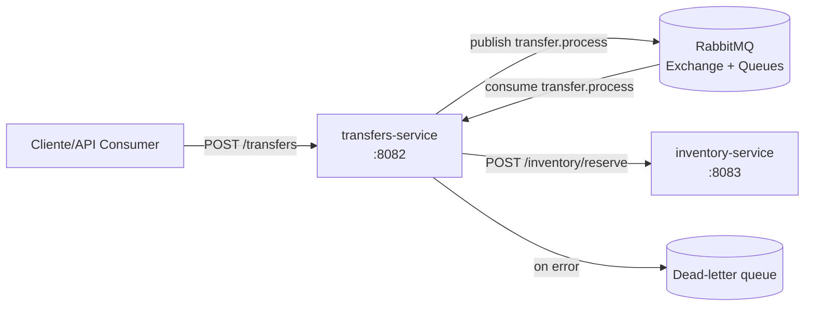

# Backend microservicios (Transfers + Inventory)

Este repositorio contiene dos microservicios Spring Boot y un broker RabbitMQ para orquestar la reserva de inventario mediante una cola de mensajes.

## Arquitectura



## Componentes

- **transfers-service**: recibe solicitudes de transferencia, publica el mensaje en RabbitMQ y consume la cola para reservar inventario vía HTTP.
- **inventory-service**: expone endpoints para consultar y reservar stock (en memoria).
- **RabbitMQ**: exchange `tarpuq.transfers` y colas `transfer.process` y `transfer.process.dlq`.

## Puertos

- transfers-service: `8082`
- inventory-service: `8083`
- RabbitMQ: `5672` (AMQP) / `15672` (management UI)

## Requisitos

- Java 17
- Maven
- Docker (para RabbitMQ)

## Ejecución local

1. Levantar RabbitMQ:

```bash
docker compose up -d
```

2. Iniciar inventory-service:

```bash
cd inventory-service
./mvnw spring-boot:run
```

3. En otra terminal, iniciar transfers-service:

```bash
cd transfers-service
./mvnw spring-boot:run
```

## Endpoints

### Inventory

- `GET /inventory/{itemCode}`

```bash
curl http://localhost:8083/inventory/RES-001
```

- `POST /inventory/reserve`

```bash
curl -X POST http://localhost:8083/inventory/reserve \
  -H 'Content-Type: application/json' \
  -d '{"itemCode":"RES-001","quantity":2}'
```

### Transfers

- `POST /transfers`

```bash
curl -X POST http://localhost:8082/transfers \
  -H 'Content-Type: application/json' \
  -d '{"itemCode":"RES-001","quantity":2,"fromWarehouse":"A","toWarehouse":"B"}'
```

La API encola la transferencia; el consumidor en `transfers-service` la procesa y llama a `inventory-service` para reservar el stock.

## Notas

- El inventario es en memoria con datos iniciales: `RES-001` (50) y `CAP-777` (20).
- Si el consumo falla (por ejemplo, inventario insuficiente), el mensaje va a la DLQ (`transfer.process.dlq`).
